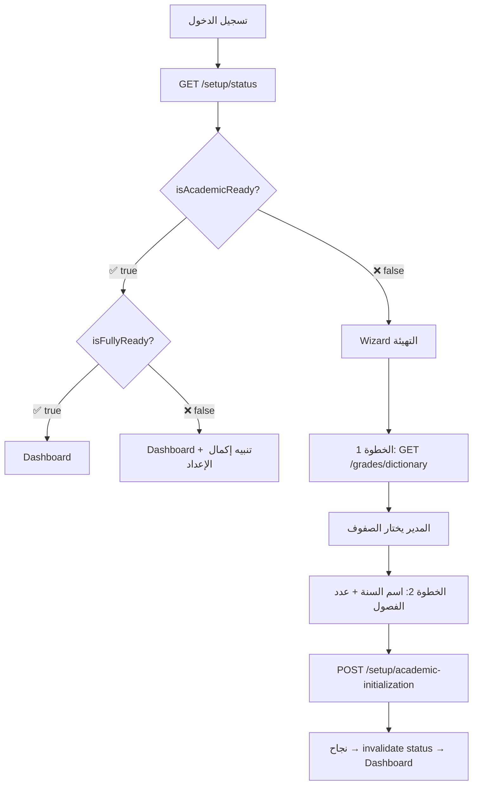

# 📚 دليل الإعداد الأكاديمي — مرجع مبرمجي Flutter

> هذه الوثيقة مرجع تفصيلي لمبرمجي Flutter حول APIs الصفوف والشُعب، السنوات والفصول، والتهيئة الأولى.
> للاطلاع السريع على كل APIs المدير → [MANAGER_README.md](./MANAGER_README.md)

**Base path:** `/school/manager/`
**Headers المطلوبة:**
```
Authorization: Bearer <jwt>
x-school-uuid: <school-uuid>
```

---

## 📑 الفهرس

1. [قاموس الصفوف الرسمية (GradeDictionary)](#1-قاموس-الصفوف-الرسمية)
2. [الصفوف (Grades)](#2-الصفوف)
3. [الشُعب (Sections)](#3-الشُعب)
4. [السنوات الدراسية (Academic Years)](#4-السنوات-الدراسية)
5. [الفصول الدراسية (Terms)](#5-الفصول-الدراسية)
6. [حالة التهيئة (Setup Status)](#6-حالة-التهيئة)
7. [التهيئة الأولى — Wizard (Academic Initialization)](#7-التهيئة-الأولى)
8. [أكواد الأخطاء](#8-أكواد-الأخطاء)
9. [التدفق المتوقع في Flutter](#9-التدفق-المتوقع-في-flutter)

---

## 1. قاموس الصفوف الرسمية

القاموس جدول **مركزي** ثابت يحتوي الصفوف الرسمية المعتمدة (الأول الابتدائي → الثالث الثانوي).
المدير **يختار** منه عند التهيئة أو يُنشئ صفوف مخصصة (محلية).

### `GET /grades/dictionary`

**Response:** `200 OK`
```json
[
  {
    "id": 1,
    "uuid": "abc-...",
    "code": "G1",
    "defaultName": "الأول الابتدائي",
    "shortName": "1 ب",
    "stage": "ابتدائي",
    "sortOrder": 1,
    "isActive": true
  },
  {
    "id": 2,
    "code": "G2",
    "defaultName": "الثاني الابتدائي",
    "shortName": "2 ب",
    "stage": "ابتدائي",
    "sortOrder": 2,
    "isActive": true
  }
]
```

| الحقل | النوع | الوصف |
|-------|------|-------|
| `id` | `int` | المعرف — يُرسل كـ `dictionaryId` عند إنشاء صف |
| `code` | `string` | كود فريد (`G1`, `G2`, …) |
| `defaultName` | `string` | الاسم الرسمي — يُستخدم تلقائياً إذا لم يُرسل `displayName` |
| `shortName` | `string?` | اختصار اختياري |
| `stage` | `GradeStage?` | المرحلة — enum: `KG` / `BASIC` / `SECONDARY` / `OTHER` |
| `sortOrder` | `int` | ترتيب العرض |

> **ملاحظة Flutter:** هذا الـ endpoint لا يتغير كثيراً. يمكن تخزينه محلياً (cache) في SQLite.

---

## 2. الصفوف

### `GET /grades`

قائمة صفوف المدرسة مع الشُعب وأعداد الطلاب.

**Response:** `200 OK`
```json
[
  {
    "id": 1,
    "uuid": "...",
    "displayName": "الأول الابتدائي",
    "shortName": "1 ب",
    "sortOrder": 1,
    "isLocal": false,
    "dictionaryId": 5,
    "isActive": true,
    "_count": { "sections": 3 },
    "sections": [
      {
        "id": 10,
        "name": "أ",
        "orderIndex": 1,
        "_count": { "enrollments": 32 }
      },
      {
        "id": 11,
        "name": "ب",
        "orderIndex": 2,
        "_count": { "enrollments": 28 }
      }
    ]
  }
]
```

---

### `POST /grades` — إنشاء صف فردي

🔹 **صف رسمي** (من القاموس):
```json
{
  "dictionaryId": 5,
  "sortOrder": 1
}
```
> `displayName` و `shortName` يُملآن تلقائياً من القاموس إذا لم يُرسلا.

🔹 **صف مخصص** (محلي):
```json
{
  "displayName": "صف تمهيدي",
  "shortName": "تمهيدي",
  "sortOrder": 0,
  "stage": "KG"
}
```

> ⚠️ `stage` **إجباري للصف المخصص**. القيم المتاحة: `KG` | `BASIC` | `SECONDARY` | `OTHER`
> الصف الرسمي يأخذ `stage` من القاموس تلقائياً.

**Response:** `201 Created` — الصف مع الشُعب (تُنشأ شعبة "أ" تلقائياً)
```json
{
  "id": 5,
  "displayName": "الأول الابتدائي",
  "isLocal": false,
  "dictionaryId": 5,
  "sections": [
    { "id": 20, "name": "أ", "orderIndex": 1 }
  ]
}
```

**الأخطاء المحتملة:**

| الكود | HTTP | السبب |
|-------|------|-------|
| `INVALID_DICTIONARY_GRADE` | `400` | `dictionaryId` غير موجود أو غير نشط |
| `GRADE_DICTIONARY_ALREADY_ADDED` | `409` | الصف الرسمي مضاف مسبقاً |
| `GRADE_NAME_DUPLICATE` | `409` | اسم الصف مكرر |

---

### `POST /grades/bulk` — إنشاء عدة صفوف (Atomic)

يُنشئ جميع الصفوف + شُعبها الافتراضية في **Transaction واحدة**.
إذا فشل أي صف → يتراجع الكل (Rollback).

```json
{
  "grades": [
    { "dictionaryId": 1, "sortOrder": 1 },
    { "dictionaryId": 2, "sortOrder": 2 },
    { "dictionaryId": 3, "sortOrder": 3 },
    { "displayName": "تمهيدي", "sortOrder": 0 }
  ]
}
```

**Response:** `201 Created` — مصفوفة الصفوف المُنشأة مع شُعبها.

**الأخطاء الإضافية:**

| الكود | HTTP | السبب |
|-------|------|-------|
| `EMPTY_GRADES_LIST` | `400` | قائمة فارغة |
| `DISPLAY_NAME_REQUIRED` | `400` | صف مخصص بدون `displayName` |
| `INVALID_DICTIONARY_GRADE_{id}` | `400` | `dictionaryId` محدد غير صالح |
| `ONE_OR_MORE_DICTIONARY_GRADES_ALREADY_ADDED` | `409` | أحد الصفوف الرسمية مضاف مسبقاً |

---

### `PATCH /grades/:id` — تعديل صف

```json
{
  "displayName": "الاسم الجديد",
  "shortName": "ج",
  "sortOrder": 5
}
```
جميع الحقول اختيارية. **Response:** `200 OK` — الصف المحدّث.

---

### `DELETE /grades/:id` — حذف صف (Soft)

**Response:** `200 OK` — `{ "success": true }`

| خطأ | HTTP | السبب |
|-----|------|-------|
| `GRADE_HAS_STUDENTS` | `400` | شُعب الصف تحتوي طلاب نشطين |

---

### `PATCH /grades/:id/toggle-active` — تفعيل/تعطيل صف

```json
{ "isActive": false }
```

---

## 3. الشُعب

### `GET /grades/:gradeId/sections`

```json
[
  {
    "id": 10,
    "name": "أ",
    "orderIndex": 1,
    "isActive": true,
    "_count": { "enrollments": 32 }
  }
]
```

### `POST /grades/:gradeId/sections` — إنشاء شعبة

```json
{ "name": "ب", "orderIndex": 2 }
```

| خطأ | HTTP | السبب |
|-----|------|-------|
| `SECTION_NAME_DUPLICATE` | `409` | اسم الشعبة مكرر في نفس الصف |
| `SECTION_ORDER_DUPLICATE` | `409` | ترتيب مكرر في نفس الصف |

### `PATCH /grades/sections/:sectionId` — تعديل شعبة

```json
{ "name": "ج", "orderIndex": 3 }
```

### `DELETE /grades/sections/:sectionId` — حذف شعبة

| خطأ | HTTP | السبب |
|-----|------|-------|
| `SECTION_HAS_STUDENTS` | `400` | شعبة فيها طلاب نشطين |

---

## 4. السنوات الدراسية

### `GET /academic-years`

```json
[
  {
    "id": 1,
    "name": "2025-2026",
    "startDate": "2025-09-01",
    "endDate": "2026-06-30",
    "isCurrent": true,
    "terms": [
      { "id": 1, "name": "الفصل الأول", "orderIndex": 1, "isCurrent": true,  "startDate": "2025-09-01" },
      { "id": 2, "name": "الفصل الثاني", "orderIndex": 2, "isCurrent": false, "startDate": "2026-01-15" }
    ]
  }
]
```

### `GET /academic-years/current`

السنة الحالية فقط (`isCurrent: true`). يُرجع `null` إذا لم تُهيأ.

---

### `POST /academic-years` — إنشاء سنة جديدة

🔹 **بعدد فصول فقط** (يُسمي النظام تلقائياً):
```json
{
  "name": "2025-2026",
  "termsCount": 2
}
```
> ⚠️ إذا لم تُرسل تواريخ فصول، تبقى تواريخ السنة `null`. إذا أُرسلت تواريخ الفصول، تُحسب تلقائياً.

🔹 **بفصول مخصصة** (تواريخ السنة تُشتق تلقائياً من الفصول):
```json
{
  "name": "2025-2026",
  "terms": [
    { "name": "الفصل الأول",  "orderIndex": 1, "startDate": "2025-09-01", "endDate": "2025-12-30" },
    { "name": "الفصل الثاني", "orderIndex": 2, "startDate": "2026-01-15", "endDate": "2026-06-30" }
  ]
}
```

> ⚠️ **سلوك مهم:**
> - السنة الجديدة تصبح **الحالية** تلقائياً
> - السنة السابقة تُلغى (`isCurrent: false`)
> - أول فصل يكون **الحالي** تلقائياً (`isCurrent: true`)
> - **تواريخ السنة تُشتق دائماً من الفصول** (أقل بداية فصل = بداية السنة)
> - كل هذا يحدث في **Transaction واحدة**

---

### `PATCH /academic-years/:yearId` — تعديل سنة

```json
{ "name": "2025-2026 (معدل)", "endDate": "2026-07-15" }
```

---

## 5. الفصول الدراسية

### `PATCH /academic-years/terms/:termId` — تعديل فصل

```json
{
  "name": "الفصل الأول (ممتد)",
  "startDate": "2025-09-01",
  "endDate": "2026-01-10"
}
```

### `POST /academic-years/:yearId/advance-term` — التقدم للفصل التالي

**🔒 Transaction:** يُلغي الفصل الحالي ويُفعّل التالي بشكل atomic.

**Response:** `200 OK` — السنة مع فصولها المحدّثة.

| خطأ | HTTP | السبب |
|-----|------|-------|
| `NO_NEXT_TERM` | `400` | الفصل الحالي هو الأخير (أو لا يوجد فصل حالي) |

---

## 6. حالة التهيئة

### `GET /setup/status`

Endpoint خفيف يُرجع ملخص جاهزية المدرسة. يُستخدم كـ **Gatekeeper** لتحديد هل يدخل المدير Dashboard أم Wizard.

**Response:** `200 OK`
```json
{
  "hasCurrentYear": false,
  "currentYearId": null,
  "currentTermId": null,
  "termsCount": 0,
  "hasGrades": false,
  "gradesCount": 0,
  "hasSections": false,
  "sectionsCount": 0,
  "hasTeachers": false,
  "teachersCount": 0,
  "hasSubjects": false,
  "subjectsCount": 0,
  "isAcademicReady": false,
  "isReadyForStudents": false,
  "isFullyReady": false
}
```

**حقول الجاهزية:**

| الحقل | القاعدة | الاستخدام |
|-------|---------|----------|
| `isAcademicReady` | سنة حالية + فصول + صفوف + شُعب | هل يمكن دخول Dashboard؟ |
| `isReadyForStudents` | = `isAcademicReady` | هل يمكن إضافة طلاب؟ |
| `isFullyReady` | أكاديمي + مواد + معلمين | هل النظام مكتمل الإعداد؟ |

---

## 7. التهيئة الأولى

### `POST /setup/academic-initialization`

> **⭐ هذا هو الـ Endpoint الرئيسي لمعالج التهيئة (Setup Wizard)**

يُنشئ الصفوف + الشُعب الافتراضية + السنة + الفصول في **Transaction واحدة**.
إذا فشل أي جزء → يتراجع الكل ولا يبقى النظام في حالة نصف مهيأة.

```json
{
  "grades": [
    { "dictionaryId": 1, "sortOrder": 1 },
    { "dictionaryId": 2, "sortOrder": 2 },
    { "displayName": "التمهيدي", "shortName": "تمهيدي", "sortOrder": 0, "stage": "KG" }
  ],
  "year": {
    "name": "2025-2026",
    "terms": [
      { "name": "الفصل الأول",  "orderIndex": 1, "startDate": "2025-09-01", "endDate": "2025-12-30" },
      { "name": "الفصل الثاني", "orderIndex": 2, "startDate": "2026-01-15", "endDate": "2026-06-30" }
    ]
  }
}
```

> ⚠️ **قواعد التهيئة:**
> - `terms[]` **إجبارية** مع `startDate` + `endDate` لكل فصل
> - تواريخ السنة **تُحسب تلقائياً** من الفصول (لا تُرسل)
> - `stage` **إجباري للصفوف المخصصة** (`KG` / `BASIC` / `SECONDARY` / `OTHER`)
> - الصفوف الرسمية تأخذ `stage` من القاموس تلقائياً
> - **منع التداخل الزمني** بين الفصول (فصل 2 يبدأ بعد انتهاء فصل 1)

**Response:** `200 OK`
```json
{ "success": true }
```

**ماذا يحدث داخلياً؟**
1. يتحقق أن المدرسة **غير مهيأة** (لا توجد سنة)
2. لكل صف:
   - إذا `dictionaryId` → يتحقق من وجوده ونشاطه → يأخذ الاسم من القاموس تلقائياً
   - إذا مُخصص → يتطلب `displayName`
   - يُنشئ الصف + شعبة "أ" افتراضية
3. يُنشئ السنة (`isCurrent: true`)
4. يُنشئ الفصول (الأول = `isCurrent: true`)

**الأخطاء المحتملة:**

| الكود | HTTP | السبب |
|-------|------|-------|
| `ACADEMIC_ALREADY_INITIALIZED` | `409` | المدرسة مهيأة مسبقاً (توجد سنة) |
| `INVALID_DICTIONARY_GRADE_{id}` | `400` | `dictionaryId` غير موجود أو غير نشط |
| `DISPLAY_NAME_REQUIRED` | `400` | صف مخصص بدون `displayName` |

---

## 8. أكواد الأخطاء

جدول شامل لجميع أكواد الأخطاء في هذا القسم:

| الكود | HTTP | الـ Endpoint | الوصف |
|-------|------|-------------|-------|
| `INVALID_DICTIONARY_GRADE` | `400` | POST grades | dictionaryId غير صالح |
| `DISPLAY_NAME_REQUIRED` | `400` | POST bulk / initialization | صف مخصص بدون اسم |
| `EMPTY_GRADES_LIST` | `400` | POST grades/bulk | قائمة فارغة |
| `GRADE_HAS_STUDENTS` | `400` | DELETE grades/:id | صف فيه طلاب |
| `SECTION_HAS_STUDENTS` | `400` | DELETE sections/:id | شعبة فيها طلاب |
| `NO_NEXT_TERM` | `400` | POST advance-term | لا يوجد فصل تالي |
| `STAGE_REQUIRED_FOR_CUSTOM_GRADE` | `400` | POST initialization | صف مخصص بدون `stage` |
| `TERM_n_END_BEFORE_START` | `400` | POST initialization | نهاية الفصل قبل بدايته |
| `TERM_n_OVERLAPS_WITH_TERM_m` | `400` | POST initialization | تداخل زمني بين فصلين |
| `GRADE_DICTIONARY_ALREADY_ADDED` | `409` | POST grades | صف رسمي مكرر |
| `GRADE_NAME_DUPLICATE` | `409` | POST/PATCH grades | اسم صف مكرر |
| `SECTION_NAME_DUPLICATE` | `409` | POST sections | اسم شعبة مكرر |
| `SECTION_ORDER_DUPLICATE` | `409` | POST sections | ترتيب شعبة مكرر |
| `ACADEMIC_ALREADY_INITIALIZED` | `409` | POST initialization | المدرسة مهيأة مسبقاً |
| `YEAR_NOT_FOUND` | `404` | GET years/:id | سنة غير موجودة |
| `GRADE_NOT_FOUND` | `404` | GET grades/:id | صف غير موجود |

---

## 9. التدفق المتوقع في Flutter

### 🔄 عند تسجيل الدخول (أول مرة)



### 📱 كود Flutter المتوقع

```dart
// 1. فحص الحالة
final status = await setupRepository.getStatus();

if (!status.isAcademicReady) {
  // عرض الـ Wizard
  context.go('/setup-wizard');
  return;
}

// 2. Dashboard
context.go('/dashboard');
```

```dart
// 3. Wizard — إرسال التهيئة
Future<void> submitSetup(SetupDraft draft) async {
  await setupRepository.initializeAcademic(
    AcademicInitializationRequest(
      grades: draft.selectedGrades.map((g) =>
        GradeInput(dictionaryId: g.id, sortOrder: g.sortOrder)
      ).toList(),
      year: YearInput(
        name: draft.yearName,
        startDate: draft.startDate,
        endDate: draft.endDate,
        termsCount: draft.termsCount,
      ),
    ),
  );

  // إعادة تحميل الحالة
  ref.invalidate(setupStatusProvider);
}
```

### 📱 بعد التهيئة — CRUD عادي

بعد إتمام Wizard التهيئة، يستطيع المدير:

| العملية | الـ Endpoint | ملاحظة |
|---------|-------------|--------|
| إضافة صف آخر | `POST /grades` | فردي |
| إضافة شعبة | `POST /grades/:id/sections` | |
| تعديل صف/شعبة | `PATCH /grades/:id` | |
| حذف صف/شعبة | `DELETE /grades/:id` | فقط إذا فارغ |
| تعديل فصل | `PATCH /academic-years/terms/:id` | |
| التقدم للفصل التالي | `POST /academic-years/:id/advance-term` | |

---

## ⚙️ قيود قاعدة البيانات

| القيد | الوصف |
|-------|-------|
| `uq_school_dictionary_grade` | Partial unique: لا يمكن تكرار نفس `dictionaryId` لنفس `schoolId` (فقط للصفوف غير المحذوفة) |
| `isCurrent` على Year | سنة واحدة فقط تكون حالية لكل مدرسة |
| `isCurrent` على Term | فصل واحد فقط حالي لكل سنة |
| Soft Delete | الحذف يُعيّن `isDeleted: true` بدون حذف فعلي |
| Default Section | عند إنشاء أي صف يُنشأ شعبة "أ" (`orderIndex: 1`) تلقائياً |
| Transaction Safety | `createYear`, `advanceToNextTerm`, `createGrade`, `createGradesBulk`, `initializeAcademic` — كلها محمية بـ `$transaction` |
