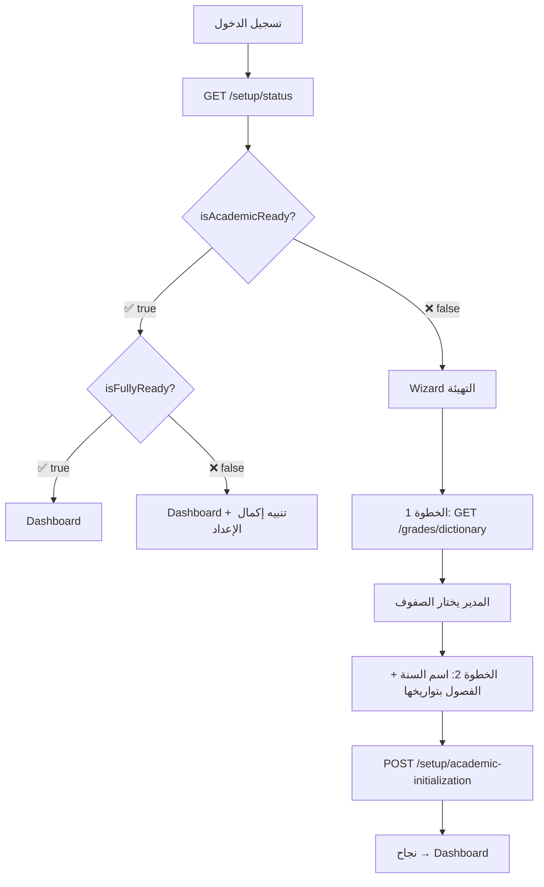

//docs/

# ⚙️ الإعدادات الأكاديمية — Academic Setup Guide

> التهيئة الأولية، الصفوف والشُعب، السنوات والفصول الدراسية.
> للاطلاع السريع على كل APIs المدير → [MANAGER_README.md](./MANAGER_README.md)

**Base path:** `/school/manager/`
**Headers:**
```
Authorization: Bearer <jwt>
x-school-uuid: <school-uuid>
```

---

## 📑 الفهرس

1. [التهيئة الأولى — Setup Wizard](#1-التهيئة-الأولى)
2. [حالة التهيئة (Setup Status)](#2-حالة-التهيئة)
3. [قاموس الصفوف الرسمية](#3-قاموس-الصفوف-الرسمية)
4. [الصفوف (Grades)](#4-الصفوف)
5. [الشُعب (Sections)](#5-الشُعب)
6. [السنوات الدراسية (Academic Years)](#6-السنوات-الدراسية)
7. [الفصول الدراسية (Terms)](#7-الفصول-الدراسية)
8. [أكواد الأخطاء](#8-أكواد-الأخطاء)
9. [التدفق المتوقع في Flutter](#9-التدفق-المتوقع-في-flutter)

---

## 1. التهيئة الأولى

### `POST /setup/academic-initialization`

> **⭐ Endpoint الـ Setup Wizard — يُنشئ كل شيء في عملية واحدة**

يُنشئ الصفوف + الشُعب الافتراضية + السنة + الفصول في **Transaction واحدة**.
إذا فشل أي جزء → يتراجع الكل. المدرسة لن تبقى في حالة نصف مهيأة.

```json
{
  "grades": [
    { "dictionaryId": 1, "sortOrder": 1 },
    { "dictionaryId": 2, "sortOrder": 2 },
    { "displayName": "التمهيدي", "shortName": "تمهيدي", "sortOrder": 0, "stage": "KG" }
  ],
  "year": {
    "name": "2025-2026",
    "terms": [
      { "name": "الفصل الأول",  "orderIndex": 1, "startDate": "2025-09-01", "endDate": "2025-12-30" },
      { "name": "الفصل الثاني", "orderIndex": 2, "startDate": "2026-01-15", "endDate": "2026-06-30" }
    ]
  }
}
```

> ⚠️ **قواعد التهيئة:**
> - `terms[]` **إجبارية** مع `startDate` + `endDate` لكل فصل
> - السنة ليس لها تواريخ خاصة — **لا تُرسل startDate/endDate للسنة**
> - `stage` **إجباري للصفوف المخصصة**: `KG` | `BASIC` | `SECONDARY` | `OTHER`
> - الصفوف الرسمية تأخذ `stage` من القاموس تلقائياً
> - **منع التداخل الزمني** بين الفصول
> - المدرسة يجب أن تكون **غير مهيأة** (لا توجد سنة)

**Response:** `200 OK`
```json
{ "success": true }
```

**ماذا يحدث داخلياً؟**
1. يتحقق أن المدرسة **غير مهيأة**
2. يتحقق من تسلسل تواريخ الفصول ومنع التداخل
3. لكل صف: إذا `dictionaryId` → يأخذ الاسم + `stage` من القاموس | إذا مخصص → يتطلب `displayName` + `stage`
4. يُنشئ الصف + شعبة "أ" افتراضية
5. يُنشئ السنة (`isCurrent: true`)
6. يُنشئ الفصول (الأول = `isCurrent: true`)

**الأخطاء:**

| الكود | HTTP | السبب |
|-------|------|-------|
| `ACADEMIC_ALREADY_INITIALIZED` | `409` | المدرسة مهيأة مسبقاً |
| `INVALID_DICTIONARY_GRADE_{id}` | `400` | `dictionaryId` غير موجود أو غير نشط |
| `DISPLAY_NAME_REQUIRED` | `400` | صف مخصص بدون `displayName` |
| `STAGE_REQUIRED_FOR_CUSTOM_GRADE` | `400` | صف مخصص بدون `stage` |
| `TERM_n_END_BEFORE_START` | `400` | نهاية فصل قبل بدايته |
| `TERM_n_OVERLAPS_WITH_TERM_m` | `400` | تداخل زمني بين فصلين |

---

## 2. حالة التهيئة

### `GET /setup/status`

Endpoint خفيف يُرجع ملخص جاهزية المدرسة. يُستخدم كـ **Gatekeeper** لتحديد هل يدخل المدير Dashboard أم Wizard.

**Response:** `200 OK`
```json
{
  "hasCurrentYear": false,
  "currentYearUuid": null,
  "currentTermUuid": null,
  "termsCount": 0,
  "hasGrades": false,
  "gradesCount": 0,
  "hasSections": false,
  "sectionsCount": 0,
  "hasTeachers": false,
  "teachersCount": 0,
  "hasSubjects": false,
  "subjectsCount": 0,
  "isAcademicReady": false,
  "isReadyForStudents": false,
  "isFullyReady": false
}
```

**حقول الجاهزية:**

| الحقل | القاعدة | الاستخدام |
|-------|---------|----------|
| `isAcademicReady` | سنة حالية + فصول + صفوف + شُعب | هل يمكن دخول Dashboard؟ |
| `isReadyForStudents` | = `isAcademicReady` | هل يمكن إضافة طلاب؟ |
| `isFullyReady` | أكاديمي + مواد + معلمين | هل النظام مكتمل الإعداد؟ |

---

## 3. قاموس الصفوف الرسمية

القاموس جدول **مركزي** ثابت يحتوي الصفوف الرسمية المعتمدة.
المدير **يختار** منه عند التهيئة أو يُنشئ صفوف مخصصة.

### `GET /grades/dictionary`

```json
[
  {
    "id": 1,
    "uuid": "abc-...",
    "code": "G1",
    "defaultName": "الأول الابتدائي",
    "shortName": "1 ب",
    "stage": "BASIC",
    "sortOrder": 1,
    "isActive": true
  }
]
```

| الحقل | النوع | الوصف |
|-------|------|-------|
| `id` | `int` | يُرسل كـ `dictionaryId` عند إنشاء صف |
| `code` | `string` | كود فريد (`G1`, `G2`, …) |
| `defaultName` | `string` | الاسم الرسمي |
| `shortName` | `string?` | اختصار اختياري |
| `stage` | `GradeStage?` | enum: `KG` / `BASIC` / `SECONDARY` / `OTHER` |
| `sortOrder` | `int` | ترتيب العرض |

> 💡 **Flutter:** يمكن تخزينه محلياً (cache) — لا يتغير كثيراً.

---

## 4. الصفوف

### `GET /grades`

قائمة صفوف المدرسة مع الشُعب وأعداد الطلاب.

```json
[
  {
    "id": 1,
    "uuid": "...",
    "displayName": "الأول الابتدائي",
    "shortName": "1 ب",
    "sortOrder": 1,
    "stage": "BASIC",
    "isLocal": false,
    "dictionaryId": 5,
    "isActive": true,
    "_count": { "sections": 3 },
    "sections": [
      { "id": 10, "name": "أ", "orderIndex": 1, "_count": { "enrollments": 32 } },
      { "id": 11, "name": "ب", "orderIndex": 2, "_count": { "enrollments": 28 } }
    ]
  }
]
```

---

### `POST /grades` — إنشاء صف فردي

🔹 **صف رسمي** (من القاموس):
```json
{ "dictionaryId": 5, "sortOrder": 1 }
```
> `displayName`، `shortName`، `stage` تُملأ تلقائياً من القاموس.

🔹 **صف مخصص**:
```json
{ "displayName": "صف تمهيدي", "shortName": "تمهيدي", "sortOrder": 0, "stage": "KG" }
```
> ⚠️ `stage` **إجباري للصف المخصص**. `displayName` **إجباري**.

**Response:** `201 Created` — الصف مع شعبة "أ" تلقائياً.

| الكود | HTTP | السبب |
|-------|------|-------|
| `INVALID_DICTIONARY_GRADE` | `400` | dictionaryId غير صالح |
| `GRADE_DICTIONARY_ALREADY_ADDED` | `409` | الصف الرسمي مضاف مسبقاً |
| `GRADE_NAME_DUPLICATE` | `409` | اسم مكرر |
| `GRADE_NOT_FOUND` | `404` | الصف غير موجود (أو ليس تابعاً لمدرستك) |

---

### `POST /grades/bulk` — إنشاء عدة صفوف (Atomic)

Transaction واحدة. فشل أي صف → Rollback الكل.

```json
{
  "grades": [
    { "dictionaryId": 1, "sortOrder": 1 },
    { "dictionaryId": 2, "sortOrder": 2 },
    { "displayName": "تمهيدي", "sortOrder": 0, "stage": "KG" }
  ]
}
```

| الكود | HTTP | السبب |
|-------|------|-------|
| `EMPTY_GRADES_LIST` | `400` | قائمة فارغة |
| `ONE_OR_MORE_DICTIONARY_GRADES_ALREADY_ADDED` | `409` | صف رسمي مكرر |

---

### `PATCH /grades/:id` — تعديل صف

```json
{ "displayName": "الاسم الجديد", "shortName": "ج", "sortOrder": 5 }
```
جميع الحقول اختيارية. **Response:** `200 OK`.

### `DELETE /grades/:id` — حذف صف (Soft)

| خطأ | HTTP | السبب |
|-----|------|-------|
| `GRADE_HAS_STUDENTS` | `400` | شُعب الصف تحتوي طلاب |

### `PATCH /grades/:id/toggle-active`

```json
{ "isActive": false }
```

---

## 5. الشُعب

### `GET /grades/:gradeId/sections`

```json
[
  { "id": 10, "name": "أ", "orderIndex": 1, "isActive": true, "_count": { "enrollments": 32 } }
]
```

### `POST /grades/:gradeId/sections`

```json
{ "name": "ب", "orderIndex": 2 }
```

| خطأ | HTTP | السبب |
|-----|------|-------|
| `SECTION_NAME_DUPLICATE` | `409` | اسم مكرر |
| `SECTION_ORDER_DUPLICATE` | `409` | ترتيب مكرر |

### `PATCH /grades/sections/:sectionId`

```json
{ "name": "ج", "orderIndex": 3 }
```

### `DELETE /grades/sections/:sectionId`

| خطأ | HTTP | السبب |
|-----|------|-------|
| `SECTION_HAS_STUDENTS` | `400` | شعبة فيها طلاب |

### `PATCH /grades/sections/:sectionId/toggle-active`

```json
{ "isActive": false }
```

---

## 6. السنوات الدراسية

> ⚠️ السنة ليس لها `startDate`/`endDate` — التواريخ تُشتق من الفصول.

### `GET /academic-years`

```json
[
  {
    "id": 1,
    "uuid": "...",
    "name": "2025-2026",
    "isCurrent": true,
    "terms": [
      { "id": 1, "name": "الفصل الأول", "orderIndex": 1, "isCurrent": true,  "startDate": "2025-09-01", "endDate": "2025-12-30" },
      { "id": 2, "name": "الفصل الثاني", "orderIndex": 2, "isCurrent": false, "startDate": "2026-01-15", "endDate": "2026-06-30" }
    ]
  }
]
```

### `GET /academic-years/current`

السنة الحالية فقط. يُرجع `null` إذا لم تُهيأ.

---

### `POST /academic-years` — إنشاء سنة جديدة

```json
{
  "name": "2026-2027",
  "terms": [
    { "name": "الفصل الأول",  "orderIndex": 1, "startDate": "2026-09-01", "endDate": "2026-12-30" },
    { "name": "الفصل الثاني", "orderIndex": 2, "startDate": "2027-01-15", "endDate": "2027-06-30" }
  ]
}
```

> ⚠️ **سلوك مهم:**
> - `terms[]` **إجبارية** مع `startDate` + `endDate` لكل فصل
> - يتحقق من التسلسل الزمني ومنع التداخل
> - السنة الجديدة تصبح **الحالية** تلقائياً
> - السنة السابقة تُلغى (`isCurrent: false`)
> - أول فصل يكون **الحالي** (`isCurrent: true`)
> - كل هذا في **Transaction واحدة**

---

### `PATCH /academic-years/:yearId` — تعديل سنة

```json
{ "name": "2025-2026 (معدل)" }
```
> فقط الاسم يمكن تعديله.

---

## 7. الفصول الدراسية

> ⚠️ **حد أقصى 3 فصول** لكل سنة دراسية.

### `PATCH /academic-years/terms/:termId` — تعديل فصل

```json
{
  "name": "الفصل الأول (ممتد)",
  "startDate": "2025-09-01",
  "endDate": "2026-01-10"
}
```

> 🛡️ **قواعد التعديل:**
> - **لا يُعدّل فصل منتهٍ** (`endDate` في الماضي وليس الحالي)
> - **لا يُغيّر `startDate`** للفصل الحالي (`isCurrent: true`)
> - **`endDate` يجب أن يكون بعد `startDate`**
> - **يتحقق من عدم التداخل** مع فصول أخرى في نفس السنة

| الكود | HTTP | السبب |
|-------|------|-------|
| `TERM_NOT_FOUND` | `404` | فصل غير موجود |
| `TERM_ALREADY_FINISHED` | `400` | الفصل منتهٍ |
| `CANNOT_CHANGE_START_DATE_OF_CURRENT_TERM` | `400` | محاولة تغيير بداية الفصل الحالي |
| `END_DATE_BEFORE_START_DATE` | `400` | النهاية قبل البداية |
| `TERM_OVERLAP` | `409` | تداخل مع فصل آخر |

---

### `POST /academic-years/:yearId/terms` — إضافة فصل لسنة قائمة

```json
{
  "name": "الفصل الثالث",
  "startDate": "2026-04-01",
  "endDate": "2026-06-30"
}
```

> `orderIndex` يُحسب تلقائياً (آخر ترتيب + 1). الفصل الجديد **لا يكون حالياً**.

> 🛡️ **الشروط:**
> - السنة يجب أن تكون **حالية** (`isCurrent: true`)
> - **حد أقصى 3 فصول** لكل سنة
> - الفصل الجديد يجب أن يكون **بعد آخر فصل زمنياً**
> - لا يوجد **تداخل زمني** مع الفصول القائمة

| الكود | HTTP | السبب |
|-------|------|-------|
| `YEAR_NOT_FOUND` | `404` | سنة غير موجودة |
| `YEAR_NOT_CURRENT` | `400` | السنة ليست الحالية |
| `MAX_TERMS_LIMIT` | `409` | تجاوز الحد الأقصى (3 فصول) |
| `END_DATE_BEFORE_START_DATE` | `400` | النهاية قبل البداية |
| `TERM_DATE_OVERLAP` | `409` | تداخل زمني مع فصل قائم |

---

### `POST /academic-years/:yearId/advance-term` — التقدم للفصل التالي

**🔒 Transaction:** يُلغي الفصل الحالي ويُفعّل التالي.

> 🛡️ يعمل فقط على **السنة الحالية**.

| خطأ | HTTP | السبب |
|-----|------|-------|
| `YEAR_NOT_CURRENT` | `400` | السنة ليست الحالية |
| `NO_NEXT_TERM` | `400` | الفصل الحالي هو الأخير |

---

### `DELETE /academic-years/terms/:termId` — حذف فصل (Soft Delete)

> 🛡️ **الشروط:**
> - الفصل **لا يكون الحالي** (`isCurrent: false`)
> - السنة يجب أن تبقى **بفصل واحد على الأقل**

**Response:** `200 OK` — `{ "success": true }`

| الكود | HTTP | السبب |
|-------|------|-------|
| `TERM_NOT_FOUND` | `404` | فصل غير موجود |
| `CANNOT_DELETE_CURRENT_TERM` | `400` | لا يمكن حذف الفصل الحالي |
| `LAST_TERM_CANNOT_BE_DELETED` | `400` | آخر فصل لا يُحذف |

## 8. أكواد الأخطاء

### التهيئة والصفوف

| الكود | HTTP | الـ Endpoint | الوصف |
|-------|------|-------------|-------|
| `ACADEMIC_ALREADY_INITIALIZED` | `409` | initialization | المدرسة مهيأة مسبقاً |
| `INVALID_DICTIONARY_GRADE` | `400` | grades | dictionaryId غير صالح |
| `INVALID_DICTIONARY_GRADE_{id}` | `400` | bulk / initialization | dictionaryId محدد غير صالح |
| `DISPLAY_NAME_REQUIRED` | `400` | grades / initialization | صف مخصص بدون اسم |
| `STAGE_REQUIRED_FOR_CUSTOM_GRADE` | `400` | initialization | صف مخصص بدون `stage` |
| `EMPTY_GRADES_LIST` | `400` | grades/bulk | قائمة فارغة |
| `GRADE_HAS_STUDENTS` | `400` | DELETE grades | صف فيه طلاب |
| `GRADE_NOT_FOUND` | `404` | grades | صف غير موجود |
| `GRADE_DICTIONARY_ALREADY_ADDED` | `409` | grades | صف رسمي مكرر |
| `GRADE_NAME_DUPLICATE` | `409` | grades | اسم صف مكرر |
| `SECTION_HAS_STUDENTS` | `400` | DELETE sections | شعبة فيها طلاب |
| `SECTION_NOT_FOUND` | `404` | sections | شعبة غير موجودة |
| `SECTION_NAME_DUPLICATE` | `409` | sections | اسم شعبة مكرر |
| `SECTION_ORDER_DUPLICATE` | `409` | sections | ترتيب شعبة مكرر |

### السنوات والفصول

| الكود | HTTP | الـ Endpoint | الوصف |
|-------|------|-------------|-------|
| `YEAR_NOT_FOUND` | `404` | academic-years | سنة غير موجودة |
| `YEAR_NOT_CURRENT` | `400` | addTerm / advance-term | السنة ليست الحالية |
| `TERM_NOT_FOUND` | `404` | updateTerm | فصل غير موجود |
| `TERM_ALREADY_FINISHED` | `400` | updateTerm | الفصل منتهٍ لا يقبل التعديل |
| `CANNOT_CHANGE_START_DATE_OF_CURRENT_TERM` | `400` | updateTerm | لا يمكن تغيير بداية الفصل الحالي |
| `END_DATE_BEFORE_START_DATE` | `400` | updateTerm / addTerm | النهاية قبل البداية |
| `TERM_OVERLAP` | `409` | updateTerm | تداخل مع فصل آخر |
| `MAX_TERMS_LIMIT` | `409` | addTerm | تجاوز الحد الأقصى (3 فصول) |
| `TERM_DATE_OVERLAP` | `409` | addTerm | تداخل زمني مع فصل قائم |
| `NO_NEXT_TERM` | `400` | advance-term | لا يوجد فصل تالي |
| `CANNOT_DELETE_CURRENT_TERM` | `400` | deleteTerm | لا يمكن حذف الفصل الحالي |
| `LAST_TERM_CANNOT_BE_DELETED` | `400` | deleteTerm | آخر فصل لا يُحذف |
| `TERM_n_END_BEFORE_START` | `400` | createYear / initialization | نهاية فصل قبل بدايته |
| `TERM_n_OVERLAPS_WITH_TERM_m` | `400` | createYear / initialization | تداخل زمني بين فصلين |

---

## 9. التدفق المتوقع في Flutter

### 🔄 عند تسجيل الدخول (أول مرة)



### 📱 بعد التهيئة — CRUD عادي

| العملية | الـ Endpoint | ملاحظة |
|---------|-------------|--------|
| إضافة صف | `POST /grades` | فردي أو `/bulk` |
| إضافة شعبة | `POST /grades/:id/sections` | |
| تعديل صف/شعبة | `PATCH /grades/:id` | |
| حذف صف/شعبة | `DELETE /grades/:id` | فقط إذا فارغ |
| إنشاء سنة جديدة | `POST /academic-years` | مع فصولها |
| إضافة فصل لسنة قائمة | `POST /academic-years/:id/terms` | حد أقصى 3 فصول |
| تعديل فصل | `PATCH /academic-years/terms/:id` | لا يُعدّل المنتهي |
| حذف فصل | `DELETE /academic-years/terms/:id` | ليس الحالي وليس الأخير |
| التقدم للفصل التالي | `POST /academic-years/:id/advance-term` | السنة الحالية فقط |

---

## ⚙️ قيود قاعدة البيانات

| القيد | الوصف |
|-------|-------|
| `uq_school_dictionary_grade` | Partial unique: لا يمكن تكرار `dictionaryId` لنفس المدرسة |
| `isCurrent` على Year | سنة واحدة حالية لكل مدرسة |
| `isCurrent` على Term | فصل واحد حالي لكل سنة |
| Year بدون تواريخ | التواريخ مشتقة من فصولها |
| Soft Delete | `isDeleted: true` بدون حذف فعلي |
| Default Section | عند إنشاء صف يُنشأ شعبة "أ" تلقائياً |
| School Scope | كل عملية update/delete تتحقق أن المورد تابع للمدرسة |
| Transaction Safety | `createYear`, `advanceToNextTerm`, `createGrade`, `createGradesBulk`, `initializeAcademic` — كلها `$transaction` |

## 🔐 ملاحظة أمنية

جميع عمليات التعديل والحذف تتحقق أن المورد (صف/شعبة/سنة/فصل) **تابع لمدرسة المستخدم الحالي**. محاولة الوصول لمورد مدرسة أخرى تُرجع `404 NOT_FOUND`.
