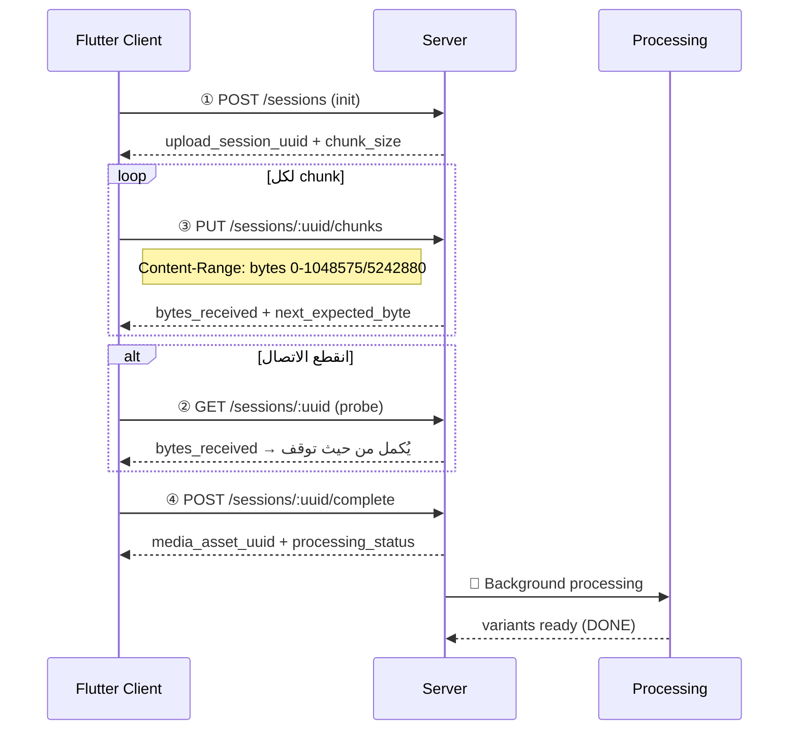

//docs/

# 🎬 نظام الوسائط — Media System Guide

> رفع الملفات (Chunked + Resume)، تنزيل (Range + ETag)، معالجة (Variants)، تنظيف تلقائي.

**Base path:** `/school/`
**Headers:**
```
Authorization: Bearer <jwt>
x-school-uuid: <school-uuid>
```

---

## 📑 الفهرس

1. [نظرة عامة](#1-نظرة-عامة)
2. [رفع الملفات — Upload Flow](#2-رفع-الملفات)
3. [تنزيل الملفات — Download](#3-تنزيل-الملفات)
4. [Metadata](#4-metadata)
5. [المعالجة — Processing Pipeline](#5-المعالجة)
6. [التنظيف التلقائي — Cleanup](#6-التنظيف-التلقائي)
7. [أكواد الأخطاء](#7-أكواد-الأخطاء)
8. [التدفق المتوقع في Flutter](#8-التدفق-المتوقع-في-flutter)
9. [البنية الداخلية](#9-البنية-الداخلية)

---

## 1. نظرة عامة

### البنية المعمارية

```
media.module.ts
├── MediaController          → تنزيل + metadata       (GET /school/media/...)
├── MediaUploadController    → رفع chunked + resume    (POST/GET/PUT /school/media-upload/...)
├── MediaService             → جلب assets + resolve variants
├── MediaUploadService       → إدارة جلسات الرفع
├── MediaProcessingService   → إنشاء variants (sharp لصور، placeholder لصوت)
├── MediaCleanupService      → تنظيف تلقائي (sessions + assets)
└── StorageService           → عمليات الملفات على VPS
```

### أنواع الوسائط

| النوع | الحد الأقصى | Variants |
|-------|------------|----------|
| `IMAGE` | 20MB | `original` (WebP)، `medium` (600px)، `small` (200px) |
| `AUDIO` | 50MB | `original`، `low` (= original حالياً — MVP) |

### مسار التخزين

```
/var/data/asas/storage/
├── tmp/                              ← ملفات مؤقتة أثناء الرفع
│   └── {session_uuid}.part
└── {school_uuid}/
    └── {asset_uuid}/
        ├── original.webp             ← النسخة الأصلية
        ├── medium.webp               ← 600px
        └── small.webp                ← 200px
```

> 💡 المسار يُقرأ من `MEDIA_STORAGE_PATH` environment variable (default: `/var/data/asas/storage`).

---

## 2. رفع الملفات

> 🔐 الأدوار المسموحة: `ADMIN` + `TEACHER`

### التدفق الكامل



---

### `POST /media-upload/sessions` — ① بدء جلسة الرفع

```json
{
  "kind": "IMAGE",
  "contentType": "image/jpeg",
  "totalSizeBytes": 5242880,
  "chunkSizeBytes": 1048576
}
```

| الحقل | النوع | ملاحظة |
|-------|------|--------|
| `kind` | `enum` | `IMAGE` \| `AUDIO` |
| `contentType` | `string` | يجب أن يتوافق مع `kind` (`image/*` لصور، `audio/*` لصوت) |
| `totalSizeBytes` | `int` | الحجم الكلي (حد أقصى حسب `kind`) |
| `chunkSizeBytes` | `int?` | اختياري — default: 1MB, min: 64KB |

**Response:** `201`
```json
{
  "upload_session_uuid": "abc-...",
  "media_asset_uuid": "def-...",
  "chunk_size_bytes": 1048576,
  "expires_at": "2026-03-03T00:00:00.000Z"
}
```

> ⏱️ الجلسة تنتهي بعد **24 ساعة**.
> يُنشئ `MediaAsset` placeholder بحالة `PENDING`.

---

### `GET /media-upload/sessions/:uuid` — ② استعلام/استئناف

يُستخدم لمعرفة كم وصل من البايتات عند انقطاع الاتصال.

**Response:** `200`
```json
{
  "upload_session_uuid": "abc-...",
  "status": "UPLOADING",
  "bytes_received": 2097152,
  "total_size_bytes": 5242880,
  "chunk_size_bytes": 1048576,
  "processing_status": null,
  "media_asset_uuid": "def-...",
  "expires_at": "2026-03-03T00:00:00.000Z"
}
```

---

### `PUT /media-upload/sessions/:uuid/chunks` — ③ رفع Chunk

**Headers:**
```
Content-Type: application/octet-stream
Content-Range: bytes 0-1048575/5242880
```

**Body:** Binary chunk data

**Response:** `200`
```json
{
  "bytes_received": 1048576,
  "next_expected_byte": 1048576
}
```

> ⚠️ **القواعد:**
> - Chunks يجب أن تكون **متسلسلة** — `start` = `bytes_received` الحالي
> - إذا أرسل chunk خارج الترتيب → `409 OUT_OF_ORDER` مع `bytes_received` الحالي
> - الجلسة المنتهية الصلاحية → `410 SESSION_EXPIRED`

---

### `POST /media-upload/sessions/:uuid/complete` — ④ إكمال الرفع

**Response:** `200`
```json
{
  "media_asset_uuid": "def-...",
  "processing_status": "PROCESSING"
}
```

> ⚠️ **يتحقق أن كل البايتات وصلت.**
> بعد الإكمال:
> - ينقل الملف المؤقت → المسار النهائي
> - يُطلق المعالجة في الخلفية (لا يحجب الاستجابة)
> - الـ idempotent: استدعاء complete مرتين يُرجع نفس النتيجة

---

### `POST /media-upload/sessions/:uuid/cancel` — ⑤ إلغاء

**Response:** `200`
```json
{ "status": "CANCELED" }
```

> يحذف الملف المؤقت + soft-delete للـ MediaAsset placeholder.

---

## 3. تنزيل الملفات

### `GET /media/:uuid` — تنزيل ملف

| Query Param | الوصف | Default |
|-------------|-------|---------|
| `variant` | `original` \| `medium` \| `small` \| `low` | IMAGE→`medium`, AUDIO→`low` |

**Headers المدعومة:**

| Header | السلوك |
|--------|--------|
| `Range: bytes=0-1023` | يُرجع `206 Partial Content` |
| `If-None-Match: "etag..."` | يُرجع `304 Not Modified` إذا لم يتغير |

**Response Headers:**
```
ETag: "abc123..."
Accept-Ranges: bytes
Content-Type: image/webp
Cache-Control: private, max-age=86400
Content-Length: 12345
```

---

## 4. Metadata

### `GET /media/:uuid/meta` — بيانات الملف

**Response:** `200`
```json
{
  "asset_uuid": "def-...",
  "kind": "IMAGE",
  "content_type": "image/webp",
  "variants": {
    "original": {
      "etag": "\"abc...\"",
      "size_bytes": 520000,
      "content_type": "image/webp",
      "width": 1920,
      "height": 1080
    },
    "medium": {
      "etag": "\"def...\"",
      "size_bytes": 85000,
      "content_type": "image/webp",
      "width": 600,
      "height": 338
    },
    "small": {
      "etag": "\"ghi...\"",
      "size_bytes": 12000,
      "content_type": "image/webp",
      "width": 200,
      "height": 113
    }
  },
  "processing_status": "DONE",
  "updated_at": "2026-03-01T..."
}
```

> 🔒 `storage_key` لا يُرسل للعميل — المسارات الداخلية مخفية.

---

## 5. المعالجة

### Pipeline الصور (sharp)

```
Original JPEG/PNG → WebP (q90) = original
                  → Resize 600px + WebP (q80) = medium
                  → Resize 200px + WebP (q70) = small
                  🧹 حذف الملف الأصلي (JPEG/PNG) بعد التحويل
```

> إذا الصورة أصغر من 600px → `medium` = `original`.

### Pipeline الصوت (MVP)

```
Original MP3/AAC/... = original
                     = low (نسخة طبق الأصل — TODO: ffmpeg → Opus 64kbps)
```

### حالات المعالجة

| الحالة | المعنى |
|--------|--------|
| `PENDING` | تم إنشاء الـ asset لكن لم يكتمل الرفع |
| `PROCESSING` | الرفع اكتمل والمعالجة جارية |
| `DONE` | جاهز للتنزيل |
| `ERROR` | فشلت المعالجة |

---

## 6. التنظيف التلقائي

| المهمة | التكرار | الوصف |
|--------|---------|-------|
| تنظيف الجلسات المنتهية | **كل ساعة** | sessions لم تكتمل + انتهت صلاحيتها → حذف temp + CANCELED + soft-delete asset |
| حذف الملفات القديمة | **كل 24 ساعة** | assets soft-deleted > 30 يوم → حذف ملفات + hard-delete من DB |

> 🔄 ينطلق أول تنظيف بعد **5 دقائق** من بدء التطبيق.

---

## 7. أكواد الأخطاء

### الرفع

| الكود | HTTP | السبب |
|-------|------|-------|
| `FILE_TOO_LARGE` | `400` | تجاوز الحجم (20MB صور / 50MB صوت) |
| `CONTENT_TYPE_MISMATCH` | `400` | `contentType` لا يتوافق مع `kind` |
| `SESSION_NOT_FOUND` | `404` | جلسة غير موجودة |
| `SESSION_EXPIRED` | `410` | انتهت صلاحية الجلسة (24 ساعة) |
| `SESSION_ALREADY_COMPLETED` | `409` | الجلسة مكتملة |
| `SESSION_CANCELED` | `409` | الجلسة ملغية |
| `INVALID_CONTENT_RANGE` | `400` | صيغة `Content-Range` غير صحيحة |
| `EMPTY_CHUNK` | `400` | chunk فارغ أو غير صالح |
| `OUT_OF_ORDER` | `409` | chunk خارج الترتيب (يُرجع `bytes_received` الحالي) |
| `INCOMPLETE_UPLOAD` | `400` | بايتات ناقصة عند complete |

### التنزيل

| الكود | HTTP | السبب |
|-------|------|-------|
| `ASSET_NOT_FOUND` | `404` | asset غير موجود أو ليس تابعاً للمدرسة |
| `VARIANTS_NOT_READY` | `404` | المعالجة لم تكتمل |
| `VARIANT_NOT_FOUND` | `404` | النسخة المطلوبة غير موجودة |
| `FILE_NOT_FOUND` | `404` | الملف الفعلي غير موجود على القرص |

---

## 8. التدفق المتوقع في Flutter

### رفع صورة

```dart
// ① بدء الجلسة
final session = await api.post('/media-upload/sessions', {
  'kind': 'IMAGE',
  'contentType': 'image/jpeg',
  'totalSizeBytes': file.lengthSync(),
});

final chunkSize = session['chunk_size_bytes'];
final sessionUuid = session['upload_session_uuid'];

// ② رفع Chunks
int offset = 0;
while (offset < totalSize) {
  final end = min(offset + chunkSize, totalSize);
  final chunk = file.readSync(offset, end - offset);

  await api.put(
    '/media-upload/sessions/$sessionUuid/chunks',
    data: chunk,
    headers: {
      'Content-Range': 'bytes $offset-${end - 1}/$totalSize',
      'Content-Type': 'application/octet-stream',
    },
  );
  offset = end;
}

// ③ إكمال
final result = await api.post('/media-upload/sessions/$sessionUuid/complete');
// result.media_asset_uuid → يُحفظ في DB المحلي
```

### استئناف بعد انقطاع

```dart
// Probe: أين توقفنا؟
final probe = await api.get('/media-upload/sessions/$sessionUuid');
int offset = probe['bytes_received'];
// أكمل الرفع من offset...
```

### تنزيل صورة

```dart
// تنزيل medium variant (default للصور)
final response = await api.get('/media/$assetUuid?variant=medium');

// تنزيل بالتجزئة (Range)
final response = await api.get('/media/$assetUuid', headers: {
  'Range': 'bytes=0-1023',
});

// Cache: استخدم ETag
final cached = await api.get('/media/$assetUuid', headers: {
  'If-None-Match': savedEtag,
});
// 304 → استخدم النسخة المحلية
```

---

## 9. البنية الداخلية

### Prisma Models

#### `MediaAsset` — سجل الوسيط

| الحقل | النوع | الوصف |
|-------|------|-------|
| `uuid` | `string` | معرّف فريد |
| `kind` | `enum` | `IMAGE` \| `AUDIO` |
| `storageKey` | `string?` | مسار التخزين الداخلي |
| `contentType` | `string` | مثل `image/webp` |
| `sizeBytes` | `BigInt` | حجم الملف |
| `etag` | `string?` | SHA256 مقطوع (32 حرف) |
| `variantsJson` | `string?` | JSON يحتوي metadata لكل variant |
| `processingStatus` | `enum` | `PENDING`→`PROCESSING`→`DONE`/`ERROR` |
| `rowVersion` | `int` | للمزامنة (optimistic locking) |

#### `MediaUploadSession` — جلسة الرفع

| الحقل | النوع | الوصف |
|-------|------|-------|
| `uuid` | `string` | معرّف الجلسة |
| `mediaAssetId` | `int` | FK → MediaAsset |
| `uploaderUserId` | `int` | FK → User |
| `totalSizeBytes` | `BigInt?` | الحجم الكلي |
| `bytesReceived` | `BigInt` | ما تم استلامه |
| `chunkSizeBytes` | `int` | حجم كل chunk |
| `status` | `enum` | `INITIATED`→`UPLOADING`→`COMPLETED`/`CANCELED` |
| `expiresAt` | `DateTime` | تنتهي بعد 24 ساعة |

### Content Types المدعومة

```
image/jpeg → jpg    image/png → png     image/webp → webp    image/gif → gif
audio/mpeg → mp3    audio/aac → aac     audio/ogg → ogg      audio/opus → opus
audio/wav  → wav    audio/mp4 → m4a
```

---

## ⚙️ المتغيرات البيئية

| المتغير | Default | الوصف |
|---------|---------|-------|
| `MEDIA_STORAGE_PATH` | `/var/data/asas/storage` | مسار التخزين على VPS |

## 🔐 الصلاحيات

| Controller | الأدوار | الوصف |
|------------|---------|-------|
| `MediaController` | أي مستخدم مصادق | تنزيل + metadata |
| `MediaUploadController` | `ADMIN` + `TEACHER` | رفع الملفات |
