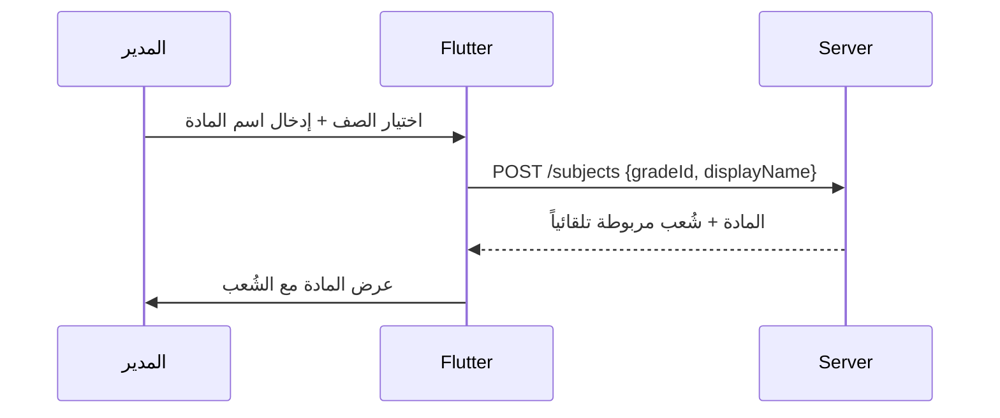
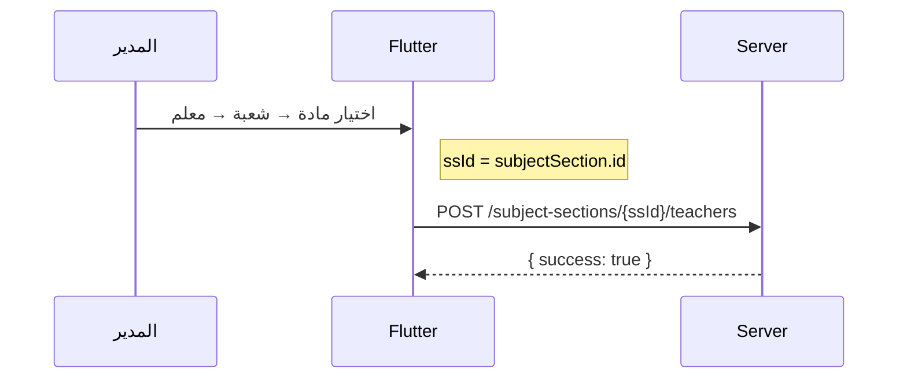

//docs/

# 📚 المواد الدراسية — Subjects API Contract

> إدارة المواد: إنشاء، تعديل، ربط بالشُعب، وإسناد المعلمين.

**Base path:** `/school/manager/subjects`
**Headers:**
```
Authorization: Bearer <jwt>
x-school-uuid: <school-uuid>
```
**الأدوار:** `ADMIN` فقط

---

## 📑 الفهرس

1. [نظرة عامة](#1-نظرة-عامة)
2. [المواد — CRUD](#2-المواد)
3. [ربط الشُعب](#3-ربط-الشُعب)
4. [إسناد المعلمين](#4-إسناد-المعلمين)
5. [أكواد الأخطاء](#5-أكواد-الأخطاء)
6. [التدفق المتوقع في Flutter](#6-التدفق-المتوقع-في-flutter)
7. [البنية الداخلية](#7-البنية-الداخلية)

---

## 1. نظرة عامة

### البنية

```
Subject (مادة)
├── grade (الصف الذي تنتمي إليه)
├── coverMediaAsset? (صورة غلاف — MediaAsset)
├── dictionaryId? (ربط بقاموس المواد الرسمية)
└── SubjectSection[] (ربط المادة بشُعب)
    └── SubjectSectionTeacher[] (إسناد معلمين)
        ├── role: PRIMARY | ASSISTANT
        └── teacher → User
```

### السلوك عند الإنشاء

> **ربط تلقائي**: عند إنشاء مادة جديدة، تُربط تلقائياً **بكل شُعب الصف** الحالية.

---

## 2. المواد

### `GET /subjects` — قائمة المواد

**Query Params:**

| Param | النوع | الوصف |
|-------|------|-------|
| `gradeId` | `int?` | فلترة حسب الصف |

**Response:** `200`
```json
[
  {
    "id": 1,
    "uuid": "...",
    "displayName": "الرياضيات",
    "shortName": "رياض",
    "gradeId": 5,
    "dictionaryId": null,
    "isActive": true,
    "grade": { "id": 5, "displayName": "الخامس" },
    "coverMediaAsset": { "uuid": "abc-..." },
    "subjectSections": [
      {
        "id": 10,
        "sectionId": 20,
        "isActive": true,
        "section": { "id": 20, "name": "أ" },
        "teachers": [
          {
            "id": 1,
            "teacherId": 100,
            "role": "PRIMARY",
            "teacher": {
              "user": { "uuid": "...", "name": "أحمد" }
            }
          }
        ]
      }
    ]
  }
]
```

> الترتيب: أبجدي حسب `displayName`.

---

### `GET /subjects/:subjectId` — مادة بالمعرف

نفس شكل الاستجابة أعلاه (كائن واحد).

---

### `POST /subjects` — إنشاء مادة

```json
{
  "displayName": "الرياضيات",
  "shortName": "رياض",
  "gradeId": 5,
  "dictionaryId": 10,
  "coverMediaAssetId": 3
}
```

| الحقل | النوع | إجباري | ملاحظة |
|-------|------|--------|--------|
| `displayName` | `string` | ✅ | 2-80 حرف، يُقلّم تلقائياً |
| `shortName` | `string?` | ❌ | حد 20 حرف |
| `gradeId` | `int` | ✅ | يجب أن ينتمي للمدرسة |
| `dictionaryId` | `int?` | ❌ | ربط بقاموس المواد |
| `coverMediaAssetId` | `int?` | ❌ | صورة الغلاف |

**السلوك:**
1. يتحقق أن الصف يخص المدرسة
2. يتحقق أن الاسم غير مكرر في نفس الصف
3. يُنشئ المادة
4. **يربطها تلقائياً بكل شُعب الصف**

**Response:** `201` — المادة مع كل بياناتها.

---

### `PATCH /subjects/:subjectId` — تعديل مادة

```json
{
  "displayName": "الرياضيات المتقدمة",
  "shortName": "رياض+",
  "coverMediaAssetId": 5
}
```

> جميع الحقول **اختيارية**. `gradeId` **لا يمكن تغييره**.
> يتحقق من عدم تكرار الاسم عند تغييره.

---

### `DELETE /subjects/:subjectId` — حذف مادة (Soft)

**Response:** `200` — `{ "success": true }`

---

## 3. ربط الشُعب

### `POST /subjects/:subjectId/sections` — ربط شُعب

```json
{
  "sectionIds": [10, 11, 12]
}
```

> يستخدم **upsert**: إذا كان الربط موجوداً (حتى لو محذوف) يُعاد تفعيله.

**Response:** `200` — المادة محدّثة.

---

### `DELETE /subjects/:subjectId/sections/:sectionId` — فك ربط شعبة

**Response:** `200` — `{ "success": true }`

> Soft delete: `isDeleted: true`.

---

## 4. إسناد المعلمين

### `POST /subject-sections/:ssId/teachers` — إسناد معلم

```json
{
  "teacherUserId": 100,
  "role": "PRIMARY"
}
```

| الحقل | النوع | الوصف |
|-------|------|-------|
| `teacherUserId` | `int` | معرف المعلم (FK → Teacher.userId) |
| `role` | `string?` | `PRIMARY` (default) \| `ASSISTANT` |

> يستخدم **upsert**: إذا كان الإسناد موجوداً يُحدّث الدور.

**Response:** `200` — `{ "success": true }`

---

### `DELETE /subject-sections/:ssId/teachers/:teacherId` — فك إسناد معلم

**Response:** `200` — `{ "success": true }`

---

## 5. أكواد الأخطاء

| الكود | HTTP | الـ Endpoint | الوصف |
|-------|------|-------------|-------|
| `SUBJECT_NOT_FOUND` | `404` | subjects | مادة غير موجودة أو ليست للمدرسة |
| `SUBJECT_ALREADY_EXISTS` | `409` | create / update | اسم مكرر في نفس الصف |
| `GRADE_NOT_FOUND` | `404` | create | الصف غير موجود أو ليس للمدرسة |
| `SUBJECT_SECTION_NOT_FOUND` | `404` | teachers | ربط المادة-الشعبة غير موجود |

---

## 6. التدفق المتوقع في Flutter

### إنشاء مادة جديدة



### إسناد معلم



### CRUD عادي

| العملية | الـ Endpoint | ملاحظة |
|---------|-------------|--------|
| إنشاء مادة | `POST /subjects` | تُربط بكل شُعب الصف |
| تعديل مادة | `PATCH /subjects/:id` | لا يُغيّر الصف |
| حذف مادة | `DELETE /subjects/:id` | soft delete |
| قائمة المواد | `GET /subjects` | filter by `?gradeId=` |
| ربط شعبة إضافية | `POST /subjects/:id/sections` | upsert |
| فك ربط شعبة | `DELETE /subjects/:id/sections/:sId` | soft delete |
| إسناد معلم | `POST /subject-sections/:ssId/teachers` | upsert |
| فك إسناد | `DELETE /subject-sections/:ssId/teachers/:tId` | soft delete |

---

## 7. البنية الداخلية

### Prisma Models

#### `Subject` — المادة

| الحقل | النوع | الوصف |
|-------|------|-------|
| `uuid` | `string` | معرّف فريد |
| `schoolId` | `int` | FK → School |
| `gradeId` | `int` | FK → SchoolGrade |
| `dictionaryId` | `int?` | FK → SubjectDictionary |
| `displayName` | `string` | اسم المادة |
| `shortName` | `string?` | اختصار |
| `coverMediaAssetId` | `int?` | FK → MediaAsset |
| `isActive` | `bool` | default: true |

#### `SubjectSection` — ربط المادة بالشعبة

| الحقل | النوع | الوصف |
|-------|------|-------|
| `subjectId` | `int` | FK → Subject |
| `sectionId` | `int` | FK → Section |
| `isActive` | `bool` | default: true |
| `notes` | `string?` | ملاحظات |

> **Unique:** `(subjectId, sectionId)` — لا يمكن تكرار ربط نفس المادة بنفس الشعبة.

#### `SubjectSectionTeacher` — إسناد المعلم

| الحقل | النوع | الوصف |
|-------|------|-------|
| `subjectSectionId` | `int` | FK → SubjectSection |
| `teacherId` | `int` | FK → Teacher.userId |
| `role` | `enum?` | `PRIMARY` (default) \| `ASSISTANT` |

> **Unique:** `(subjectSectionId, teacherId)` — معلم واحد لكل مادة-شعبة.

#### `SubjectDictionary` — قاموس المواد الرسمية

| الحقل | النوع | الوصف |
|-------|------|-------|
| `gradeDictionaryId` | `int` | FK → GradeDictionary |
| `code` | `string?` | كود فريد |
| `defaultName` | `string` | الاسم الرسمي |
| `shortName` | `string?` | اختصار |
| `sortOrder` | `int` | ترتيب العرض |
| `coverMediaAssetId` | `int?` | FK → MediaAsset |

---

## ⚙️ قيود قاعدة البيانات

| القيد | الوصف |
|-------|-------|
| `subjects_school_grade_idx` | فهرس (schoolId, gradeId) |
| `subject_sections_subject_section_key` | Unique: (subjectId, sectionId) |
| `subject_section_teachers_ss_teacher_key` | Unique: (subjectSectionId, teacherId) |
| `Soft Delete` | كل الحذف `isDeleted: true` |
| `School Scope` | كل العمليات تتحقق من انتماء المورد للمدرسة |
| `Auto-Section Bind` | عند إنشاء مادة تُربط بكل شُعب الصف |
