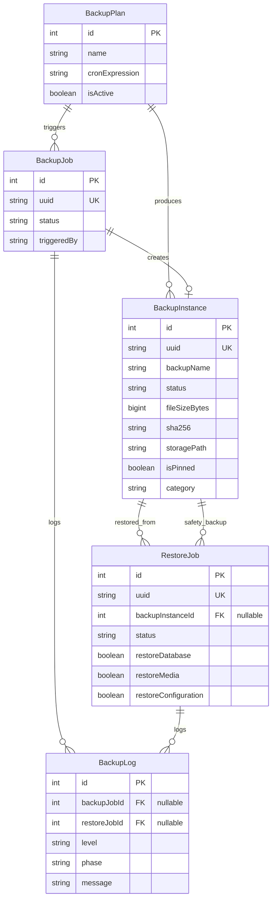

# BKP-001 — Backup & Restore System
# وثيقة مواصفات النظام (System Requirements Specification)

> **المعرف:** BKP-001-SRS  
> **الحالة:** ✅ Implemented  
> **الإصدار:** 1.0 (MVP)  
> **تاريخ الإنشاء:** 2026-07-29  
> **آخر تحديث:** 2026-07-29

---

## 1. المتطلبات الوظيفية

### FR-001 — إنشاء نسخة احتياطية

| العنصر | التفاصيل |
|--------|----------|
| **الوصف** | يمكن لمالك المنصة إنشاء نسخة احتياطية كاملة تتضمن قاعدة البيانات والوسائط والإعدادات |
| **المُنفّذ** | `BackupOrchestratorService` |
| **المدخلات** | لا شيء (يأخذ الإعدادات من `BackupPlan`) |
| **المخرجات** | ملف `tar.gz` + ملف `.sha256` + سجل `BackupInstance` |
| **الحالة** | ✅ مُنفّذ |

**قواعد العمل:**
- لا يُسمح بتشغيل أكثر من عملية نسخ في الوقت نفسه
- يجب اجتياز فحوصات ما قبل التشغيل (Preflight) قبل البدء
- الوسائط تُستخرج من `pg_dump` نفسه لضمان التناسق

---

### FR-002 — استعادة من نسخة احتياطية

| العنصر | التفاصيل |
|--------|----------|
| **الوصف** | يمكن لمالك المنصة استعادة قاعدة البيانات و/أو الوسائط و/أو الإعدادات من نسخة سابقة |
| **المُنفّذ** | `RestoreOrchestratorService` |
| **المدخلات** | `backupInstanceUuid` + خيارات (DB/Media/Config) |
| **المخرجات** | `RestoreJob` بحالة `COMPLETED` أو `FAILED` |
| **الحالة** | ✅ مُنفّذ |

**قواعد العمل:**
- يجب إنشاء Safety Backup قبل أي عملية استعادة
- يجب التحقق من سلامة الأرشيف (checksum) قبل الاستعادة
- يجب اختيار مكون واحد على الأقل
- بعد استعادة DB: يُنظّف Jobs العالقة ويُعاد إنشاء سجل RestoreJob

---

### FR-003 — النسخ الاحتياطي المجدول

| العنصر | التفاصيل |
|--------|----------|
| **الوصف** | يمكن جدولة النسخ الاحتياطي (يومي/أسبوعي/شهري) عبر Cron Expression |
| **المُنفّذ** | `BackupSchedulerService` |
| **المدخلات** | `BackupPlan.cronExpression` |
| **الحالة** | ✅ مُنفّذ |

---

### FR-004 — إدارة النسخ

| العنصر | التفاصيل |
|--------|----------|
| **الوصف** | عرض/حذف/تثبيت النسخ الاحتياطية |
| **Endpoints** | `GET/DELETE/PATCH instances` |
| **الحالة** | ✅ مُنفّذ |

**قواعد العمل:**
- النسخ المُثبّتة (Pinned) لا تُحذف تلقائياً
- Safety Backups تُثبّت تلقائياً

---

### FR-005 — لوحة معلومات النسخ الاحتياطي

| العنصر | التفاصيل |
|--------|----------|
| **الوصف** | عرض ملخص حالة النسخ (آخر نسخة، المساحة، الجدول) |
| **Endpoint** | `GET /dashboard` |
| **الحالة** | ✅ مُنفّذ |

---

## 2. قواعد العمل (Business Rules)

| المعرف | القاعدة |
|--------|---------|
| **BR-001** | لا يُسمح بتشغيل أكثر من `BackupJob` واحد في الوقت نفسه |
| **BR-002** | قبل كل عملية استعادة يجب إنشاء Safety Backup تلقائياً |
| **BR-003** | الاستعادة تتطلب التحقق من manifest.json |
| **BR-004** | يُسمح بإكمال الاستعادة حتى لو لم يعد `BackupInstance` موجوداً في قاعدة البيانات المستعادة |
| **BR-005** | `RestoreJob.backupInstanceId` قد يصبح `NULL` بعد استبدال قاعدة البيانات |
| **BR-006** | Jobs العالقة بحالة `RUNNING` تُحوّل تلقائياً إلى `FAILED` بعد استعادة DB |
| **BR-007** | Safety Backup تُوسم كـ `SYSTEM_SAFETY` ولا تُنشئ Safety Backup أخرى (منع الحلقات) |
| **BR-008** | النسخة بحالة `PARTIAL_SUCCESS` إذا نُسخت DB بنجاح لكن بعض ملفات الوسائط مفقودة |

---

## 3. حالات الاستخدام

### UC-001 — إنشاء نسخة يدوية

```
الممثل: Platform Owner
المسار الرئيسي:
  1. Owner يضغط "Create Backup"
  2. النظام يتحقق من Preflight (9 فحوصات)
  3. النظام ينفّذ pg_dump → Media Copy → Config Copy
  4. النظام ينشئ manifest → tar.gz → sha256
  5. النظام ينقل الأرشيف إلى completed/
  6. النظام يُنشئ سجل BackupInstance
  
المسار البديل:
  2a. فشل Preflight → إلغاء + تسجيل السبب
  3a. فشل pg_dump → إلغاء + FAILED
  3b. بعض الوسائط مفقودة → إكمال + PARTIAL_SUCCESS
```

### UC-002 — استعادة قاعدة البيانات

```
الممثل: Platform Owner
المسار الرئيسي:
  1. Owner يختار نسخة ويضغط "Restore"
  2. Owner يختار المكونات (DB/Media/Config)
  3. النظام يتحقق من سلامة الأرشيف
  4. النظام يُنشئ Safety Backup
  5. النظام يستخرج الأرشيف
  6. النظام يُنفّذ psql لاستعادة DB
  7. النظام يُنظّف Jobs العالقة
  8. النظام يُعيد إنشاء RestoreJob
  9. النظام يتحقق من migration
  10. النظام يُنظّف ويُعلّم COMPLETED

المسار البديل:
  3a. Checksum غير صحيح → إلغاء
  4a. Safety Backup فشل → إلغاء
  6a. psql فشل (بيئي) → إلغاء بدون Rollback
  6b. psql فشل (بيانات) → محاولة Rollback
```

---

## 4. نموذج البيانات



---

## 5. API Endpoints

| Method | Endpoint | الوصف |
|--------|----------|-------|
| `POST` | `/api/v1/owner/backups/trigger` | إنشاء نسخة احتياطية |
| `GET` | `/api/v1/owner/backups/jobs` | قائمة عمليات النسخ |
| `GET` | `/api/v1/owner/backups/jobs/:uuid` | تفاصيل عملية نسخ |
| `GET` | `/api/v1/owner/backups/instances` | قائمة النسخ المتاحة |
| `GET` | `/api/v1/owner/backups/instances/:uuid` | تفاصيل نسخة |
| `PATCH` | `/api/v1/owner/backups/instances/:uuid/pin` | تثبيت/إلغاء تثبيت نسخة |
| `DELETE` | `/api/v1/owner/backups/instances/:uuid` | حذف نسخة |
| `GET` | `/api/v1/owner/backups/plans` | قائمة خطط النسخ |
| `GET` | `/api/v1/owner/backups/plans/:id` | تفاصيل خطة |
| `PATCH` | `/api/v1/owner/backups/plans/:id` | تحديث خطة |
| `GET` | `/api/v1/owner/backups/dashboard` | لوحة معلومات |
| `POST` | `/api/v1/owner/backups/restore` | بدء استعادة |
| `GET` | `/api/v1/owner/backups/restore-jobs` | قائمة عمليات الاستعادة |
| `GET` | `/api/v1/owner/backups/restore-jobs/:uuid` | تفاصيل عملية استعادة |

---

## 6. القيود المعروفة (MVP)

| القيد | التفاصيل |
|-------|----------|
| تخزين محلي فقط | لا يدعم S3 أو تخزين خارجي |
| Full Backup فقط | لا يدعم Incremental أو Differential |
| بدون تشفير | النسخ غير مشفرة |
| بدون واجهة Flutter | الإدارة عبر API فقط حالياً |
| بدون Maintenance Mode | لا يتم إيقاف الوصول أثناء الاستعادة |
| نسخة واحدة في الوقت | لا يدعم نسخ متوازي |
| نطاق المنصة فقط | لا يدعم نسخ per-tenant |

---

## 7. الصلاحيات

| الدور | إنشاء نسخة | استعادة | حذف | عرض |
|-------|-----------|---------|------|-----|
| Platform Owner | ✅ | ✅ | ✅ | ✅ |
| مدير مدرسة | ❌ | ❌ | ❌ | ❌ |
| معلم | ❌ | ❌ | ❌ | ❌ |
| طالب | ❌ | ❌ | ❌ | ❌ |
