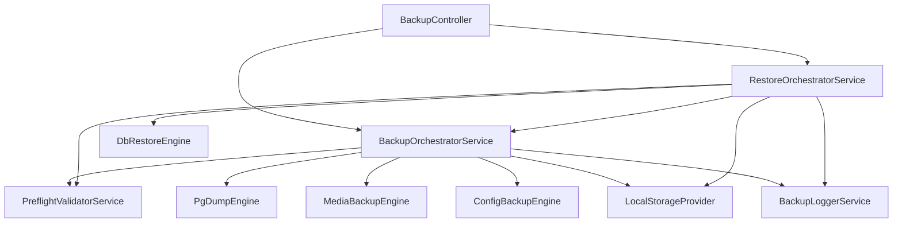

# Backup & Restore System — Implementation Walkthrough

## Overview

Full implementation of a backup and restore system for the **Asas Backend** (NestJS + Prisma + PostgreSQL). The system supports:

- **Full backups**: Database + Media + Configuration
- **Selective restore**: Choose which components to restore
- **Safety backups**: Automatic pre-restore backup for rollback
- **Job tracking**: Full lifecycle tracking with logs
- **Scheduled backups**: Cron-based automatic backups

---

## Architecture



### Pipeline Flow

````carousel
### Backup Pipeline
```
1. PREFLIGHT    → Validate environment (pg_dump, disk space, no running jobs)
2. DB_DUMP      → pg_dump → compress → database.sql.gz
3. MEDIA_COPY   → Copy media files referenced in DB
4. CONFIG_COPY  → Copy .env, nginx.conf, pm2.config.js
5. MANIFEST     → Create manifest.json with components & metadata
6. COMPRESS     → tar.gz the entire backup directory
7. CHECKSUM     → SHA-256 hash + .sha256 sidecar file
8. ACTIVATE     → Move to completed/ + create DB record
9. CLEANUP      → Delete temp directory
```
<!-- slide -->
### Restore Pipeline
```
1. VALIDATE     → Verify archive integrity (checksum)
2. SAFETY       → Create full backup before restore (pinned)
3. EXTRACT      → Extract archive to temp directory
4. MANIFEST     → Verify manifest.json
5. DB_RESTORE   → psql to restore database dump
   └── POST-DB  → Clean stale jobs + re-create RestoreJob record
6. MEDIA        → Copy media files to storage path
7. CONFIG       → Copy config files to project root
8. VERIFY       → Check latest Prisma migration exists
9. CLEANUP      → Delete temp directory + mark COMPLETED
```
````

---

## Files Created/Modified

### Core Services

| File | Purpose |
|------|---------|
| [backup-orchestrator.service.ts](file:///Users/hamdy/development/Projects/asas_backend/src/owner/backup/services/backup-orchestrator.service.ts) | Orchestrates the full backup pipeline |
| [restore-orchestrator.service.ts](file:///Users/hamdy/development/Projects/asas_backend/src/owner/backup/services/restore-orchestrator.service.ts) | Orchestrates the full restore pipeline |
| [preflight-validator.service.ts](file:///Users/hamdy/development/Projects/asas_backend/src/owner/backup/services/preflight-validator.service.ts) | Pre-flight checks before backup/restore |
| [backup-logger.service.ts](file:///Users/hamdy/development/Projects/asas_backend/src/owner/backup/services/backup-logger.service.ts) | Structured logging with DB persistence + console fallback |

### Engines

| File | Purpose |
|------|---------|
| [pg-dump.engine.ts](file:///Users/hamdy/development/Projects/asas_backend/src/owner/backup/engines/pg-dump.engine.ts) | Database dump via `pg_dump` |
| [db-restore.engine.ts](file:///Users/hamdy/development/Projects/asas_backend/src/owner/backup/engines/db-restore.engine.ts) | Database restore via `psql` |
| [media-backup.engine.ts](file:///Users/hamdy/development/Projects/asas_backend/src/owner/backup/engines/media-backup.engine.ts) | Copy media files referenced in DB |
| [config-backup.engine.ts](file:///Users/hamdy/development/Projects/asas_backend/src/owner/backup/engines/config-backup.engine.ts) | Copy configuration files |

### Storage & Schema

| File | Purpose |
|------|---------|
| [local-storage.provider.ts](file:///Users/hamdy/development/Projects/asas_backend/src/owner/backup/storage/local-storage.provider.ts) | Local filesystem storage with directory management |
| [schema.prisma](file:///Users/hamdy/development/Projects/asas_backend/prisma/schema.prisma) | `BackupPlan`, `BackupJob`, `BackupInstance`, `RestoreJob`, `BackupLog` models |

### API

| File | Purpose |
|------|---------|
| [backup.controller.ts](file:///Users/hamdy/development/Projects/asas_backend/src/owner/backup/backup.controller.ts) | REST endpoints for backup/restore operations |

---

## Key Design Decisions

### 1. `backupInstanceId` Made Optional in `RestoreJob`

> [!IMPORTANT]
> After restoring a database, the `backup_instance` record the restore was triggered from may not exist in the restored database (it was created after the backup was taken).

**Decision**: Made `restore_jobs.backup_instance_id` nullable.  
**Migration**: [20260728230000_make_restore_job_backup_instance_optional](file:///Users/hamdy/development/Projects/asas_backend/prisma/migrations/20260728230000_make_restore_job_backup_instance_optional/migration.sql)

### 2. Post-DB-Restore Recovery

After `psql` replaces the database, ALL metadata is lost (including the active `restore_job` record). The pipeline:

1. **Cleans stale RUNNING jobs** — Any backup/restore jobs that were `RUNNING` in the restored DB are marked `FAILED` (they represent historical state, not active processes)
2. **Looks up BackupInstance by UUID** — The numeric ID may change after restore
3. **Re-creates the RestoreJob** — Using Prisma `create` with optional `backupInstanceId`
4. **Updates `currentJobId`** — All subsequent operations use the new record's ID

### 3. SHA-256 Checksum Parsing

The `.sha256` sidecar file uses standard `sha256sum` format: `hash  filename`. The validator parses only the hash portion (first token), not the entire line.

### 4. Safety Backup with `skipRestoreCheck`

Safety backups (created before restore) use `skipRestoreCheck: true` in preflight validation to avoid being blocked by the active restore job's `RUNNING` status.

---

## Bugs Discovered & Fixed

| # | Bug | Root Cause | Fix |
|---|-----|-----------|-----|
| 1 | `pg_dump: invalid URI query parameter "schema"` | `?schema=public` passed to `pg_dump` via `--dbname` | Strip query params from DATABASE_URL |
| 2 | Checksum mismatch on restore | `.sha256` file parsed as raw hash, but contains `hash  filename` format | Parse first token only |
| 3 | `Pre-flight validation failed: Restore job is currently running` during safety backup | Preflight blocked safety backup because a restore was in progress | Added `skipRestoreCheck` option |
| 4 | `Foreign key constraint violated: backup_logs_restore_job_id_fkey` | Wrote log BEFORE re-creating RestoreJob after DB restore | Moved success log after upsert |
| 5 | `Record to update not found` on `restoreJob.update()` | DB restore wiped the `restore_jobs` table | Re-create RestoreJob via `create()` after restore |
| 6 | `restore_jobs_backup_instance_id_fkey` FK violation | Numeric `backupInstanceId` doesn't exist in restored DB | Lookup by UUID + make field optional |
| 7 | `Argument backupInstance is missing` | Prisma schema had `backupInstanceId Int` (required) | Changed to `Int?` + new migration |
| 8 | Stale `RUNNING` backup jobs after DB restore | Restored DB contains historical `RUNNING` state | Auto-cleanup stale jobs after DB restore |

---

## Test Results

### Final Successful Test (2026-07-29 00:14 UTC)

```
✅ Backup completed: backup_2026-07-29_00-07-33.tar.gz (PARTIAL_SUCCESS — 992/1006 media)
✅ Safety backup created and pinned
✅ Archive extracted + manifest verified
✅ Database restore completed in 4515ms
✅ Stale RUNNING jobs cleaned up
✅ Restore job record re-created
✅ Post-restore verification passed (migration: 20260307000646)
✅ Restore completed successfully — status: COMPLETED
```

> [!NOTE]
> `PARTIAL_SUCCESS` on backup is expected — 14 media files referenced in DB don't exist on disk (likely deleted externally).

---

## API Endpoints

| Method | Endpoint | Description |
|--------|----------|-------------|
| `POST` | `/api/v1/owner/backups/trigger` | Trigger manual backup |
| `GET` | `/api/v1/owner/backups/jobs` | List backup jobs |
| `GET` | `/api/v1/owner/backups/jobs/:uuid` | Get backup job details |
| `GET` | `/api/v1/owner/backups/instances` | List backup instances |
| `GET` | `/api/v1/owner/backups/instances/:uuid` | Get instance details |
| `PATCH` | `/api/v1/owner/backups/instances/:uuid/pin` | Pin/unpin instance |
| `DELETE` | `/api/v1/owner/backups/instances/:uuid` | Delete instance |
| `GET` | `/api/v1/owner/backups/plans` | List backup plans |
| `GET` | `/api/v1/owner/backups/plans/:id` | Get plan details |
| `PATCH` | `/api/v1/owner/backups/plans/:id` | Update plan |
| `GET` | `/api/v1/owner/backups/dashboard` | Dashboard summary |
| `POST` | `/api/v1/owner/backups/restore` | Trigger restore |
| `GET` | `/api/v1/owner/backups/restore-jobs` | List restore jobs |
| `GET` | `/api/v1/owner/backups/restore-jobs/:uuid` | Get restore job details |

---

## Storage Layout

```
/var/backups/mafhooom/
├── completed/                    # Finalized backups
│   ├── backup_2026-07-29_00-07-33.tar.gz
│   └── backup_2026-07-29_00-07-33.tar.gz.sha256
├── temp/                         # Working directories (cleaned up)
│   ├── <job-uuid>/               # Backup work dir
│   └── restore-<job-uuid>/       # Restore work dir
```

### Archive Structure

```
backup_<timestamp>.tar.gz
├── manifest.json
├── database/
│   └── postgres.sql.gz
├── media/
│   └── <storage-key>/original.bin
└── config/
    └── .env
```
